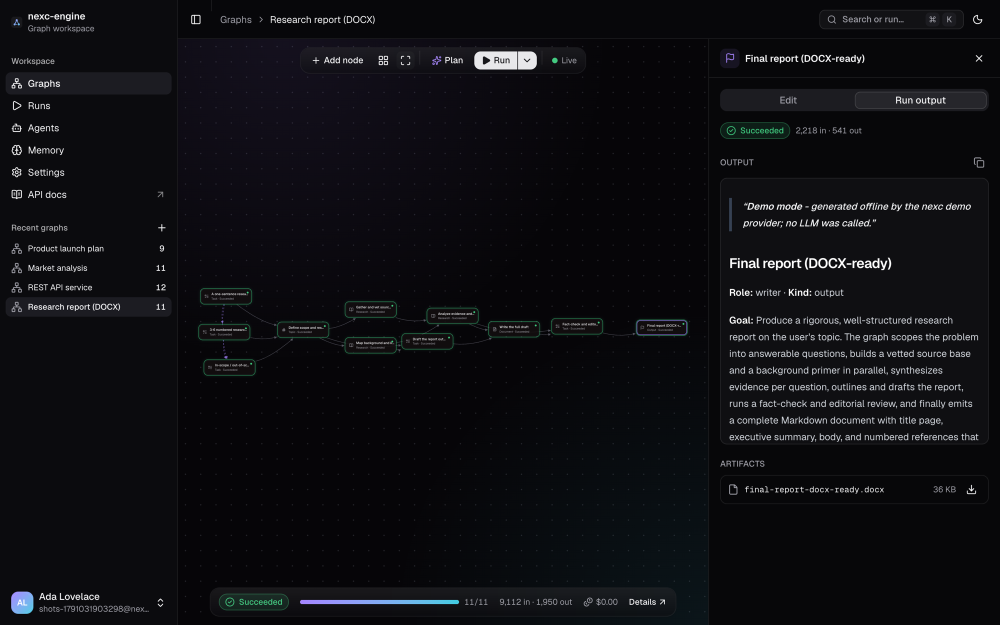
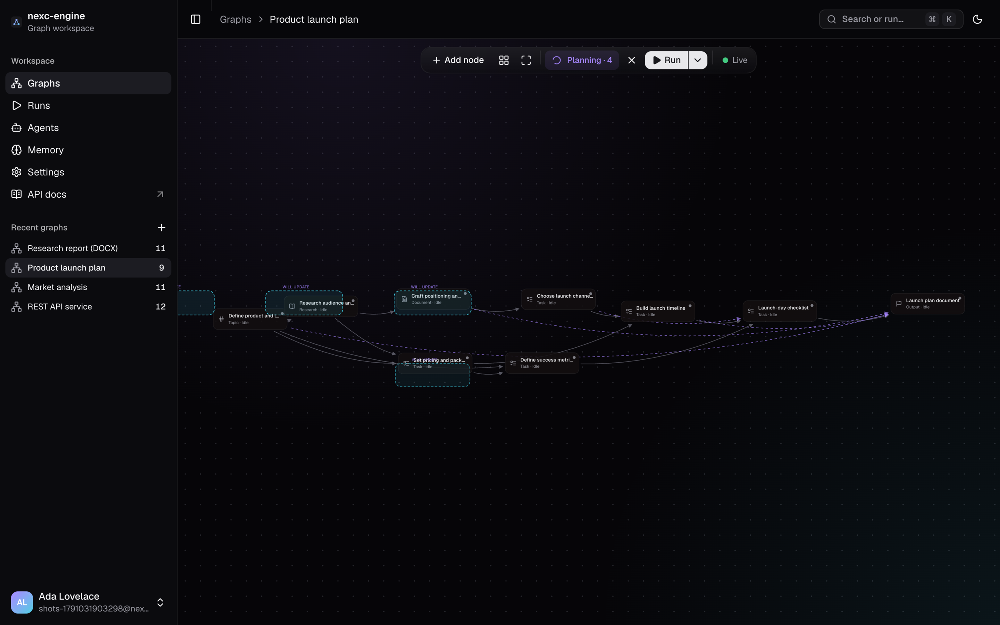
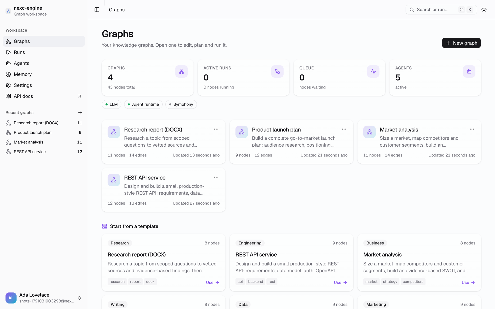
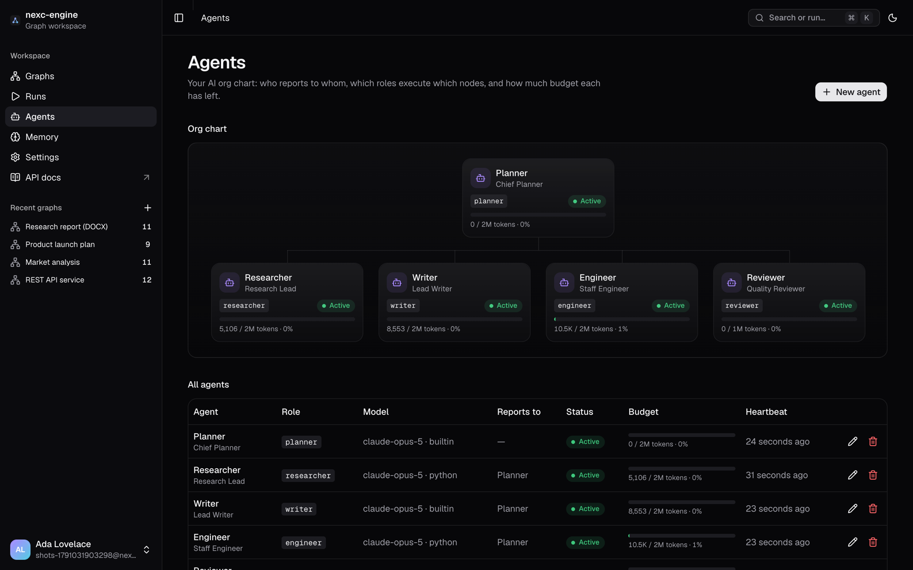
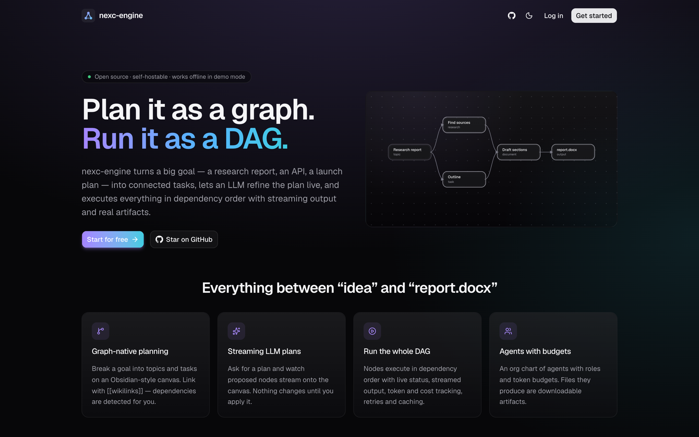
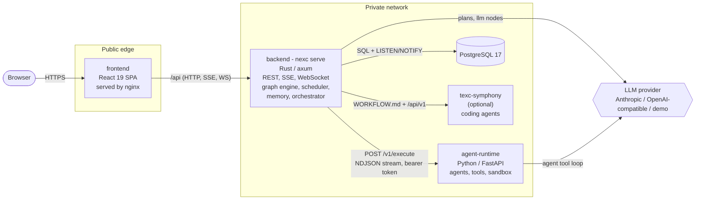

<div align="center">

# nexc-engine

**Sketch your goal as a graph of ideas. An LLM turns it into a plan. A team of agents executes it and hands you real deliverables.**

[](https://github.com/f8fvwgzc/nexc-engine/actions/workflows/ci.yml)
[](https://github.com/f8fvwgzc/nexc-engine/actions/workflows/codeql.yml)
[](LICENSE)
[](backend)
[](frontend)
[](agent-runtime)
[](docs/ARCHITECTURE.md)

[Try it in 60 seconds](#try-it-in-60-seconds) ·
[Features](#features) ·
[Architecture](#architecture) ·
[Docs](docs/ARCHITECTURE.md) ·
[Contributing](CONTRIBUTING.md)



</div>

---

nexc-engine is a self-hosted, visual **LLM graph-engineering** platform. You think in an
Obsidian-like canvas of notes and links; nexc turns that canvas into an executable plan:

1. **Sketch** – drop topics, tasks and questions on a canvas. `[[wikilinks]]` and similarity
   detection suggest the dependencies for you.
2. **Refine** – ask the LLM to turn the sketch into a concrete plan. Proposed nodes and edges stream
   in live; you review and apply them.
3. **Execute** – the scheduler runs the graph as a DAG. Each node is handled by a direct LLM call,
   by an agent "born" for that role in the Python runtime (it can spawn its own sub-agents), or by
   [texc-symphony](https://github.com/f8fvwgzc/texc-symphony) for real coding work.
4. **Collect** – outputs flow downstream as context, and every node can produce artifacts: Word
   documents, code, research notes, downloadable as a zip.

No API key? Demo mode runs the entire product offline with a deterministic provider, so you can
explore everything before you plug in Claude or a local model.

## Try it in 60 seconds

You need Docker (with Compose v2), `make` and `openssl`.

```sh
git clone https://github.com/f8fvwgzc/nexc-engine.git && cd nexc-engine
make init && docker compose up -d
```

Open **http://localhost:8080**, create an account, pick a starter template and press **Plan**, then
**Run**. `make init` generates every
secret and selects **demo mode** (no API key needed). `docker compose up` pulls the release images
or, before the first release or for local changes, builds them from source (`make docker-up` always
rebuilds).

To use Claude, put your key in `.env` (`ANTHROPIC_API_KEY=...`, `NEXC_LLM_PROVIDER=anthropic`) and
run `docker compose up -d` again, or add a personal key in the app under **Settings -> LLM**.

**Already use Claude Code?** Run nexc locally with `make dev` and set
`NEXC_LLM_PROVIDER=claude_code` (and e.g. `NEXC_LLM_MODEL=claude-sonnet-5`, `sonnet` or `haiku` for
cheaper runs): plans and agents then go through your logged-in `claude` CLI - no API key. Each call
is an isolated `claude -p` with built-in tools, MCP, hooks and sessions disabled and a scrubbed
environment.

## Screenshots

| Plan refinement streams in as ghost nodes                                                               | Dashboard with starter templates                                                                                       |
| ------------------------------------------------------------------------------------------------------- | ---------------------------------------------------------------------------------------------------------------------- |
|  |  |
| **Agents org chart with token budgets**                                                                 | **Landing page**                                                                                                       |
|                 |                                                            |

## Features

|                                 |                                                                                                                                                                                                                                                      |
| ------------------------------- | ---------------------------------------------------------------------------------------------------------------------------------------------------------------------------------------------------------------------------------------------------- |
| **Visual graph editor**         | Obsidian-like canvas with typed nodes, drag-and-drop, `[[wikilink]]` auto-edges, live multi-user presence over WebSocket.                                                                                                                            |
| **Ontology per graph**          | Node types and relation types are data, not code: each graph owns its vocabulary, the planner extends it for the goal's domain, every edge states why it exists, and only relations marked _blocking_ order execution.                               |
| **LLM plan refinement**         | One click turns a rough sketch into a structured plan; proposed nodes and edges stream over SSE and are applied atomically.                                                                                                                          |
| **DAG execution engine**        | Topological scheduling with concurrency limits, retries, timeouts, cancellation, critical-path analysis and a content-hash result cache that skips unchanged nodes.                                                                                  |
| **Agents from birth**           | Each agent node spawns a role-specific agent in the Python runtime with its own token budget; agents may delegate to sub-agents (bounded depth and fan-out).                                                                                         |
| **Real deliverables**           | Agents write files into a sandboxed workspace: `.docx` reports via python-docx, source code, Markdown research. Download per artifact or as a zip.                                                                                                   |
| **Memory**                      | Mem0/Hindsight-style: facts are extracted from node outputs, consolidated (add / update / skip near-duplicates) and retrieved by a hybrid score (embedding cosine + BM25 + recency × importance) as context for future nodes and plans.              |
| **Data structures that matter** | Graph algorithms (Kahn topological order, levels, cycles, components via union-find), priority scheduling, token-bucket rate limiting, LRU caches.                                                                                                   |
| **C kernels**                   | Hashing, MinHash similarity, feature-hashed embeddings and SHA-256 in C11, called through FFI and checked against pure-Rust reference implementations.                                                                                               |
| **Realtime**                    | SSE for run and plan progress, WebSocket for collaborative editing; fan-out across backend replicas through PostgreSQL `LISTEN/NOTIFY`.                                                                                                              |
| **Providers**                   | Anthropic Claude (default `claude-opus-5`, adaptive thinking, server-side refusal fallbacks), your local **Claude Code CLI** with its own login (no API key), any OpenAI-compatible endpoint (Ollama, vLLM, LM Studio) and an offline demo provider. |
| **OpenAPI first**               | The backend publishes `/api/openapi.json` (with a Scalar UI at `/api/docs`); the frontend generates its types from it and validates responses with zod.                                                                                              |
| **Secure by default**           | Argon2 passwords, short-lived JWTs with rotating refresh tokens and reuse detection, CSRF guard, AES-256-GCM encrypted API keys, rate limiting, non-root read-only containers, internal-only runtime and database, NetworkPolicies.                  |
| **Runs anywhere**               | `make dev` locally, Docker Compose on a single host, or Kubernetes (kustomize manifests, tested on minikube).                                                                                                                                        |

## Architecture



- **frontend** – Vite + React 19 + TypeScript SPA (graph canvas, runs, agents, memory, settings).
- **backend** – a single Rust binary, `nexc`: REST API, realtime hub, graph analysis, planner,
  DAG scheduler, memory and the orchestrator that routes nodes to executors. Stateless apart from
  the artifact volume; scale it horizontally.
- **agent-runtime** – Python service where agents are born from a spec per request and run a
  tool loop (`write_file`, `make_docx`, `spawn_subagent`, optional sandboxed `run_python`). Internal
  only; authenticated with a shared bearer token.
- **PostgreSQL 17** – the only database.
- **texc-symphony** (optional) – executes `executor: symphony` nodes as real coding tasks.

Request flows (plan and run) are described with sequence diagrams in
[docs/ARCHITECTURE.md](docs/ARCHITECTURE.md). The cross-component contract (env vars, API, events,
runtime protocol) is [docs/CONTRACT.md](docs/CONTRACT.md).

## Repository layout

```text
nexc-engine/
├── backend/             Rust (axum) API, scheduler, engine, C kernels (csrc/), SQL migrations
├── frontend/            React 19 + Vite SPA, nginx.conf for the container image
├── agent-runtime/       Python agent runtime (FastAPI, Anthropic SDK, python-docx)
├── deploy/k8s/          Kustomize manifests (namespace, Postgres, Deployments, Ingress, NetworkPolicies)
├── scripts/             init-env, dev, db, doctor and minikube helpers
├── docs/                CONTRACT.md (source of truth), ARCHITECTURE.md, media/
├── .github/             CI, CodeQL, release workflows, issue templates, Dependabot
├── docker-compose.yml   Full stack: frontend, backend, agent-runtime, postgres (+ symphony profile)
├── docker-compose.demo.yml  Overlay that pins the offline demo provider
├── Makefile             `make help` lists every command
└── .env.example         Every configuration variable with safe defaults
```

## Getting started

### 1. Local development

Prerequisites: Rust 1.99+ and a C compiler, Node.js 22.12+ with pnpm 10 (`corepack enable`),
[uv](https://docs.astral.sh/uv/) (it installs Python 3.12 for you), Docker (for PostgreSQL) and
`openssl`. `make doctor` checks all of them.

```sh
make init     # .env with generated secrets (demo mode until you add a key)
make setup    # cargo fetch, pnpm install, uv sync
make dev      # PostgreSQL in docker + backend :8080 + runtime :8090 + Vite :5173
```

Open http://localhost:5173. `make dev` prefixes each service's logs and stops everything on
Ctrl-C. Run the pieces separately with `make db-up`, `make dev-backend`, `make dev-runtime` and
`make dev-frontend`. If port 5432 is taken, set `NEXC_DB_PORT` in `.env` before `make init` (or
fix the port in `NEXC_DATABASE_URL`).

### 2. Docker Compose

```sh
make init
make docker-up        # build from source and start; http://localhost:8080
make docker-logs      # follow logs
make docker-down      # stop (named volumes keep your data)
```

Only nginx is published (`NEXC_HTTP_PORT`, default 8080). The backend, runtime and database sit on
internal networks; every container runs as non-root with a read-only root filesystem,
`cap_drop: ALL` and `no-new-privileges`. `make demo` forces demo mode regardless of `.env`.

This path is tested: `make docker-up` builds the three images from source (backend 133 MB,
frontend 62 MB, runtime 295 MB), the stack comes up healthy, and `make smoke` walks register →
plan → run → artifacts against it.

#### Putting it on the internet

Nothing in the stack serves TLS. Put a reverse proxy in front of the published port (Caddy,
nginx, Traefik, or a cloud load balancer) that terminates HTTPS and forwards to
`http://localhost:8080`, then set in `.env`:

```sh
NEXC_ENV=production                 # refuses weak secrets and demo defaults
NEXC_CORS_ORIGINS=https://nexc.example.com
NEXC_COOKIE_SECURE=true             # the refresh cookie only travels over HTTPS
NEXC_TRUST_PROXY=true               # visitor addresses come from X-Forwarded-For
```

`NEXC_TRUST_PROXY` must stay `false` without a proxy, or anyone can forge their address. A Caddy
file that does all of it: `nexc.example.com { reverse_proxy localhost:8080 }`.

#### Backups

```sh
make backup                 # database dump + files on disk → backups/<time>
make backup-check           # restore the latest into a scratch database and count what is in it
make restore FROM=backups/<time>   # into an EMPTY installation only
```

Set `NEXC_BACKUP_COMPOSE=1` for the Docker stack. Keep `NEXC_MASTER_KEY` with the backup: without
it, stored AI keys cannot be read after a restore (everything else can).

### 3. Kubernetes (minikube)

```sh
make minikube-up      # minikube + ingress + calico, builds images in-cluster, kubectl apply -k
```

Then map `nexc.local` as printed by the script and open http://nexc.local. See
[deploy/k8s/README.md](deploy/k8s/README.md) for production notes (TLS, storage, scaling).

## Configuration

All configuration is environment variables in one `.env` at the repo root. The complete,
authoritative table is [docs/CONTRACT.md §2](docs/CONTRACT.md#2-environment-variables-one-env-at-repo-root-see-envexample);
[.env.example](.env.example) documents each variable inline. The most important ones:

| Variable                                                   | Default                    | Purpose                                                        |
| ---------------------------------------------------------- | -------------------------- | -------------------------------------------------------------- |
| `NEXC_LLM_PROVIDER`                                        | `demo` (after `make init`) | `anthropic`, `openai_compatible`, `claude_code` or `demo`      |
| `ANTHROPIC_API_KEY`                                        | –                          | server-wide default key (users can store their own, encrypted) |
| `NEXC_LLM_MODEL`                                           | `claude-opus-5`            | default model                                                  |
| `NEXC_DATABASE_URL`                                        | generated                  | `postgres://…` (PostgreSQL 17)                                 |
| `NEXC_JWT_SECRET`, `NEXC_MASTER_KEY`, `NEXC_RUNTIME_TOKEN` | generated                  | secrets – never share, back up the master key with the DB      |
| `NEXC_ENV`                                                 | `development`              | `production` enforces secure cookies, HSTS and strong secrets  |
| `NEXC_ALLOW_SIGNUP`                                        | `true`                     | disable after creating your accounts                           |
| `RUNTIME_ALLOW_CODE_EXEC`                                  | `false`                    | enables the sandboxed `run_python` agent tool                  |

## CLI

The backend is one binary with subcommands:

```sh
nexc init                 # write a .env with generated secrets
nexc serve                # run migrations, then serve the API on NEXC_HOST:NEXC_PORT
nexc migrate              # apply database migrations only
nexc doctor               # check configuration, database and runtime connectivity
nexc user create          # create a user, or with --admin a platform administrator
nexc config show          # print the effective configuration (secrets redacted)
nexc openapi              # print the OpenAPI document to stdout
```

From a checkout use `cargo run --manifest-path backend/Cargo.toml -- <command>`; in Compose,
`docker compose exec backend nexc <command>`.

## texc-symphony integration

[texc-symphony](https://github.com/f8fvwgzc/texc-symphony) runs Codex coding agents against
issues. nexc can hand `executor: symphony` nodes to it:

1. Set `NEXC_SYMPHONY_ENABLED=true` in `.env`.
2. Log Codex in once (stored in the `codex-home` volume):
   `docker compose --profile symphony run --rm texc-symphony codex login`
3. Start with the profile: `docker compose --profile symphony up -d`.
4. In the graph, set a node's executor to **symphony** and run it.

The backend writes each such node as an issue (`NEXC-<id>`, state `Todo`) into a managed
`WORKFLOW.md` (`tracker.kind: memory`) on the shared `symphony-config` volume, triggers
`POST /api/v1/refresh` and follows `/api/v1/runs` until the run ends, recording status, tokens and
the final message. Outside Docker run Symphony yourself with
`symphony --port 4000 ./data/symphony/WORKFLOW.md` and point `NEXC_SYMPHONY_URL` at it.

## Security

- Secrets are generated by `make init`; production mode refuses weak ones.
- Passwords use Argon2; access tokens are short-lived JWTs, refresh tokens live in an `HttpOnly`,
  `SameSite=Strict` cookie and are rotated with reuse detection.
- Stored LLM API keys are encrypted with AES-256-GCM (`NEXC_MASTER_KEY`). Per-request keys sent
  to the runtime are never logged or persisted and are stripped from error messages.
- The agent runtime confines all file access to a per-run workspace (no absolute paths, no `..`,
  no symlink escapes) and `run_python` is off by default; when enabled it runs isolated with CPU,
  memory, file-size and process limits and a scrubbed environment.
- Containers are non-root with read-only root filesystems and no capabilities; the runtime and
  database are unreachable from outside, enforced by Compose networks or Kubernetes NetworkPolicies.
- `/metrics` is never exposed through the public edge.
- Two-factor sign-in with an authenticator app, per account, with one-time recovery codes.
- Platform administrators are walled off from workspace content on the server, not only in the
  interface; every action they take is in an activity log, and each person sees what happened to
  their own account.
- Every documented route is tested against missing, forged and other people's tokens, hostile
  input, races and a 20,000-issue workspace (`make test-worst-case`).
- What the software gives, and does not give, a GDPR or HIPAA case is laid out in
  [docs/INFRASTRUCTURE.md](docs/INFRASTRUCTURE.md).

Please report vulnerabilities privately, see [SECURITY.md](SECURITY.md).

## How it compares

nexc-engine borrows good ideas from many projects. A fair, high-level comparison (check each project
for details – they all evolve quickly):

|                                                       | Core idea                                                              | Plans its own graph with an LLM | Agents with budgets that spawn sub-agents | Produces files (docx, code) as artifacts | Stack               |
| ----------------------------------------------------- | ---------------------------------------------------------------------- | :-----------------------------: | :---------------------------------------: | :--------------------------------------: | ------------------- |
| **nexc-engine**                                       | Knowledge-graph canvas → LLM plan → DAG of agents                      |               yes               |                    yes                    |                   yes                    | Rust, React, Python |
| [n8n](https://n8n.io)                                 | General workflow automation with hundreds of integrations and AI nodes |                –                |                     –                     |             via integrations             | TypeScript          |
| [Langflow](https://www.langflow.org)                  | Visual builder for LLM flows and agents                                |                –                |                     –                     |              via components              | Python              |
| [Flowise](https://flowiseai.com)                      | Visual builder for LLM apps and agent flows                            |                –                |                     –                     |              via components              | TypeScript          |
| [CrewAI](https://www.crewai.com)                      | Code-first framework for role-based agent crews                        |                –                |         delegation between agents         |                via tools                 | Python              |
| [Paperclip](https://github.com/paperclipai/paperclip) | Orchestrating an "org chart" of agents with goals and budgets          |                –                |                    yes                    |                via agents                | TypeScript          |

Choose n8n for business automation with many SaaS integrations, Langflow or Flowise to assemble
LLM apps from components, CrewAI to build agent teams in code, and Paperclip to run a company-like
organisation of agents. nexc-engine focuses on going from a loose web of ideas to a planned,
executed and reviewable set of deliverables.

## Roadmap

- [x] Graph editor with realtime collaboration and dependency suggestions
- [x] LLM plan refinement streamed over SSE
- [x] DAG scheduler with retries, caching and cancellation
- [x] Python agent runtime with sub-agents and `.docx` deliverables
- [x] Demo mode, Docker Compose and Kubernetes manifests
- [ ] More artifact types (spreadsheets, slide decks, diagrams)
- [ ] Human-in-the-loop approval nodes and review comments on outputs
- [x] Six starter templates (research report, REST API, market analysis, blog series, data pipeline, launch plan)
- [ ] Import/export (Obsidian vaults, Markdown)
- [x] Per-workspace teams, roles and audit log
- [ ] Helm chart and OpenTelemetry tracing across backend and runtime

Ideas and votes are welcome in [Discussions](https://github.com/f8fvwgzc/nexc-engine/discussions).

## Troubleshooting

| Symptom                                        | Fix                                                                                                                                                        |
| ---------------------------------------------- | ---------------------------------------------------------------------------------------------------------------------------------------------------------- |
| `POSTGRES_PASSWORD is empty - run make init`   | Run `make init`; Compose reads secrets from `.env`.                                                                                                        |
| `make db-up`: port 5432 already in use         | Another PostgreSQL is running. Set `NEXC_DB_PORT=55432` in `.env` and use the same port in `NEXC_DATABASE_URL`.                                            |
| Backend exits with a configuration error       | `make doctor` (or `nexc doctor`) lists every missing or weak setting.                                                                                      |
| Login works but you are logged out on refresh  | Behind plain HTTP with `NEXC_ENV=production` the Secure cookie is dropped by the browser: use HTTPS, or `NEXC_COOKIE_SECURE=false` for local testing only. |
| Runs fail with "no Anthropic API key"          | Add a key in Settings -> LLM, set `ANTHROPIC_API_KEY`, or use `NEXC_LLM_PROVIDER=demo`.                                                                    |
| Agent nodes fail, LLM nodes work               | Check `docker compose logs agent-runtime`; both sides must share the same `NEXC_RUNTIME_TOKEN`.                                                            |
| 502 from nginx right after `docker compose up` | The backend is still migrating; wait for `docker compose ps` to report it healthy.                                                                         |
| `docker compose up` runs old code              | It reuses existing images; use `make docker-up` (always rebuilds).                                                                                         |
| minikube: `nexc.local` does not resolve        | Add the `/etc/hosts` line printed by `make minikube-up`; with the docker driver on macOS also keep `minikube tunnel` running.                              |

## Contributing

`make check` runs every linter and test suite; `make smoke` drives the whole product end to end
(register → template → plan → apply → run → cached re-run → artifacts → SSE) against a running stack,
and CI runs it against Docker Compose on every pull request.

Contributions of all sizes are welcome – see [CONTRIBUTING.md](CONTRIBUTING.md) for the dev setup,
conventions and commit style, and [CODE_OF_CONDUCT.md](CODE_OF_CONDUCT.md). Good first issues are
labelled [`good first issue`](https://github.com/f8fvwgzc/nexc-engine/labels/good%20first%20issue).

## Star history

<a href="https://star-history.com/#f8fvwgzc/nexc-engine&Date">
  
</a>

## License

[MIT License](LICENSE). Copyright the nexc-engine contributors.
