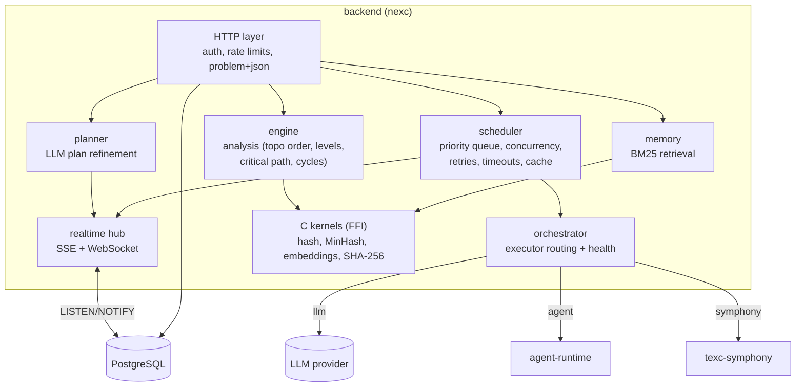
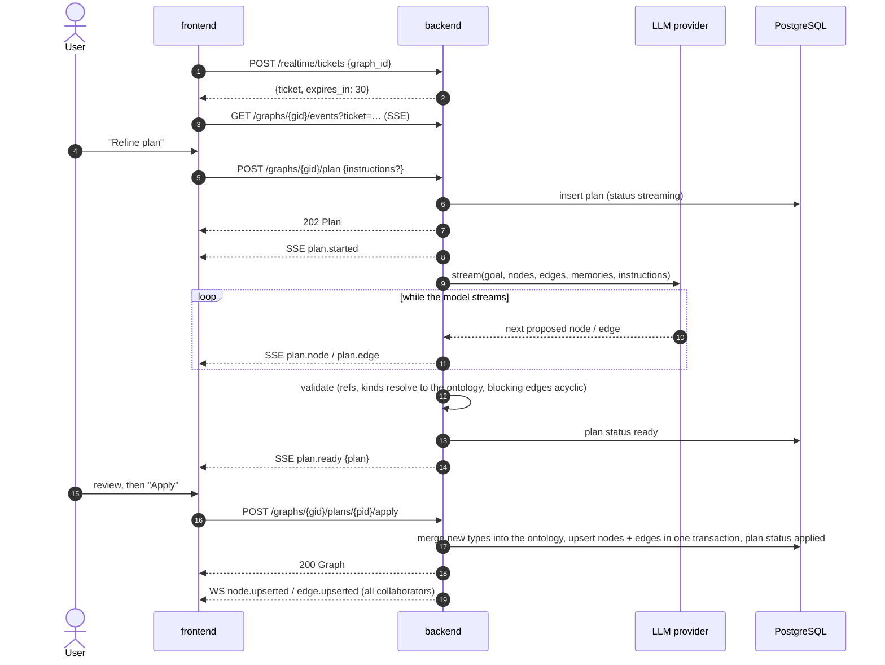
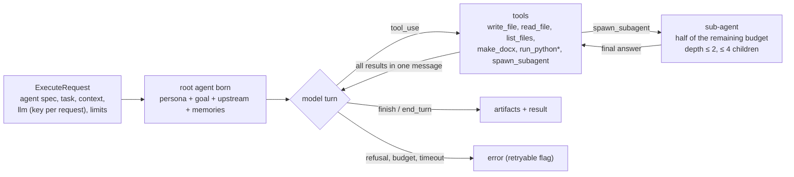

# Architecture

This document explains how a request travels through nexc-engine. The wire-level contract
(types, endpoints, events, environment) is [CONTRACT.md](CONTRACT.md); when the two disagree, the
contract wins.

## Components

| Component | Tech | Responsibility |
|---|---|---|
| **frontend** | React 19, Vite, TypeScript, TanStack Query, zod | Graph canvas, plan review, run monitoring, agents, memory, settings. Talks only to `/api/v1`. |
| **backend** (`nexc serve`) | Rust, axum, sqlx, utoipa | Auth, REST API, SSE + WebSocket hub, graph analysis, planner, scheduler, memory, orchestrator, artifact storage. |
| **agent-runtime** | Python 3.12, FastAPI, Anthropic SDK, python-docx | Executes `executor: agent` nodes: agents are born from a spec per request and run a tool loop in a sandboxed workspace. |
| **PostgreSQL 17** | | Users, graphs, nodes, edges, plans, runs, artifacts metadata, agents, memories, refresh-token families. `LISTEN/NOTIFY` carries realtime events between backend replicas. |
| **texc-symphony** (optional) | Rust | Executes `executor: symphony` nodes as Codex coding tasks. |



## Authentication in one paragraph

`POST /auth/login` returns a 15-minute JWT access token in the body and sets a rotating refresh
token in an `HttpOnly; SameSite=Strict` cookie scoped to `/api/v1/auth`. The SPA keeps the access
token in memory and refreshes with `POST /auth/refresh` (plus the `X-Requested-With: nexc` CSRF
header). Reusing an old refresh token revokes the whole token family. Realtime connections cannot
send headers, so the client first obtains a single-use, 30-second ticket from
`POST /realtime/tickets` and passes it as `?ticket=`.

Accounts are on one of two sides. A workspace-side account (`role: user`) works in its workspaces
and is refused on `/admin/*`. A platform administrator (`role: admin`) runs the installation from
the platform console and is refused on everything else: handlers take either `AuthUser` or
`PlatformAdmin` (`http/extract.rs`), and only the session endpoints take both. Each access token
carries the account's session epoch; suspending an account or changing its platform role raises
the epoch (`security/gate.rs`), so the tokens already issued stop working at once on this server
and within ten seconds on the others. Event streams and collaboration sockets note the epoch when
they open and close once it has risen.

## Flow 1: plan refinement

The user asks the LLM to turn a rough sketch into a concrete plan. The response is asynchronous:
the plan streams over SSE as it is generated, and nothing changes in the graph until the user
applies it.



If the model fails or produces an invalid plan the backend emits `plan.failed {plan_id, error}`
and the graph is untouched. In demo mode the planner is a deterministic offline generator.

### The ontology

Nothing about node or relation types is compiled in. Every graph stores an **ontology**: its node
types (label, meaning, colour, default role and executor, stage, whether its nodes deliver a file or
may run code) and its relation types (label, meaning, and whether the relation is *blocking*). A
node's `kind` and an edge's `kind` are keys into it, and every edge carries a `reason`.

A new graph starts from a small starter ontology. The planner sees the current ontology, reuses its
types where they fit and proposes new node and relation types when the goal's domain needs them;
applying the plan merges them into the graph. Users edit the ontology in the canvas toolbar. The
engine reads behaviour from the types instead of from fixed names: blocking relations form the
execution DAG (other relations record meaning only and may point "backwards"), `stage` orders
suggested dependencies, `produces_artifact` routes deliverables, and each upstream output reaches
the next node together with the reason of the edge that carried it.

## Flow 2: running a graph

Running executes the DAG of blocking edges (`depends_on` in the starter ontology). Every node's prompt context is its own title and content,
the graph goal, the outputs of its upstream nodes and retrieved memories.

```mermaid
sequenceDiagram
    autonumber
    actor U as User
    participant F as frontend
    participant B as backend (scheduler)
    participant DB as PostgreSQL
    participant R as agent-runtime
    participant L as LLM provider

    U->>F: "Run"
    F->>B: POST /graphs/{gid}/runs {node_ids?, max_concurrency?, force?}
    B->>DB: snapshot graph, insert run + node runs (queued)
    B-->>F: 202 Run
    B-->>F: SSE run.started
    B->>B: topological order, ready queue (priority = critical path)
    loop until every node is finished, skipped or cancelled
        B->>B: pop ready node (respect concurrency + rate limits)
        alt unchanged content hash and upstream outputs (and not force)
            B-->>F: SSE node.status succeeded (cached: true)
        else executor = llm
            B-->>F: SSE node.status running
            B->>L: stream prompt
            L-->>B: deltas
            B-->>F: SSE node.output / node.tokens
        else executor = agent
            B-->>F: SSE node.status running
            B->>R: POST /v1/execute (bearer NEXC_RUNTIME_TOKEN)
            R->>L: agent tool loop (adaptive thinking, tools)
            R-->>B: NDJSON log / delta / tokens / spawn / artifact
            B-->>F: SSE node.log / node.output / node.tokens
            B->>DB: store artifact metadata (bytes in NEXC_DATA_DIR)
            B-->>F: SSE artifact.created
            R-->>B: NDJSON result (or error, retryable?)
        end
        B->>DB: node run succeeded / failed, output, tokens
        B->>DB: write memories from the output
        B-->>F: SSE node.status
        Note over B: failure with retryable=true is retried up to NEXC_MAX_ATTEMPTS;<br/>downstream nodes of a failed node become skipped
    end
    B->>DB: run finished (tokens, cost)
    B-->>F: SSE run.finished
```

### The agent runtime protocol

`POST /v1/execute` returns `application/x-ndjson`. The stream always ends with exactly one
`result` or `error` line; `error.retryable` tells the scheduler whether another attempt may help
(rate limits, 5xx and network errors) or not (refusals, invalid requests, exhausted budgets,
timeouts). `tokens` lines are per LLM call (incremental); `result` carries the run totals.
Artifacts are emitted after the agent finishes: every regular file in the run's workspace,
base64-encoded, with a sanitised relative path and a MIME type, at most 20 MiB each.

Inside the runtime:



## Scaling and state

* **Backend** – stateless apart from `NEXC_DATA_DIR` (artifacts). Realtime events are published
  through PostgreSQL `LISTEN/NOTIFY`, so an SSE or WebSocket client receives events no matter which
  replica it is connected to, and you can run several replicas behind a load balancer. Scheduler
  note: a run is executed by the replica that accepted its `POST /runs`; the other replicas only
  relay its events. If that replica stops, its in-flight run is not migrated to another replica.
  With more than one node, mount the artifact directory on shared (ReadWriteMany) storage.
* **Agent runtime** – fully stateless (per-run scratch directories are deleted after each run);
  scale freely. Each instance limits concurrent runs (`RUNTIME_MAX_CONCURRENT_RUNS`, default 8) and
  answers 429 when full.
* **PostgreSQL** – the single source of truth; back it up together with `NEXC_MASTER_KEY`.

## Security boundaries

| Boundary | Control |
|---|---|
| Browser → backend | JWT + refresh-cookie rotation, CSRF header on cookie endpoints, rate limits, 1 MiB body limit, problem+json errors without internals. |
| Platform → workspaces | A platform administrator's token is refused on every workspace route; the console reads counts and members, never content. Its actions (roles, suspensions, owners, deletions) are written to an activity log, and an owner it assigns also to that workspace's audit log. |
| Backend → runtime | Shared bearer token (constant-time compare), internal network only, 4 MiB request limit, API keys passed per request and never stored or logged. |
| Agent → filesystem | Per-run workspace; `safe_path` rejects absolute paths, `..`, NUL/backslashes and symlink escapes; per-file and per-workspace quotas. |
| Agent → code execution | Disabled by default. When enabled: `python -I`, scrubbed environment, rlimits (CPU, memory, file size, processes, open files), wall-clock timeout that kills the process group, truncated output. |
| Untrusted model input | Upstream outputs and memories are wrapped in tags and the system prompt marks them as data, not instructions. |
| Containers | Non-root, read-only root filesystem, all capabilities dropped, `no-new-privileges`, seccomp `RuntimeDefault` on Kubernetes. |
